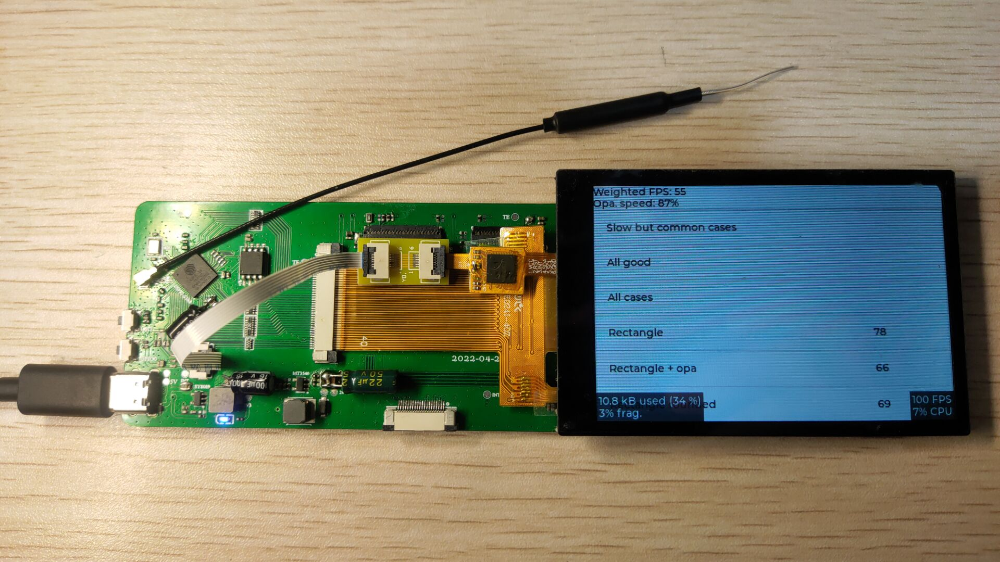

# ESP32-S3R8 的 LVGL v8.2.0 的示例工程

源项目地址：
[lv_port_esp32](https://github.com/lvgl/lv_port_esp32)

关于本项目：

- 是 **[基于 ESP32-S3R8 的屏幕验证板](https://oshwhub.com/maomaolan/esp32-s3-screen)** 的配套软件。
- ESP-IDF 版本：v4.4.1
- LVGL 版本：v8.2.0，与原本的 LVGL 的区别是在`components\lvgl\env_support\cmake\esp.cmake`里添加了 demos 的路径。
- 目前仅适配了沃乐康的 3.5 寸 ST7796S 主控的屏幕（用的是 SPI 接口，用 RGB 接口时只能 5FPS😅）。

一些图片：

